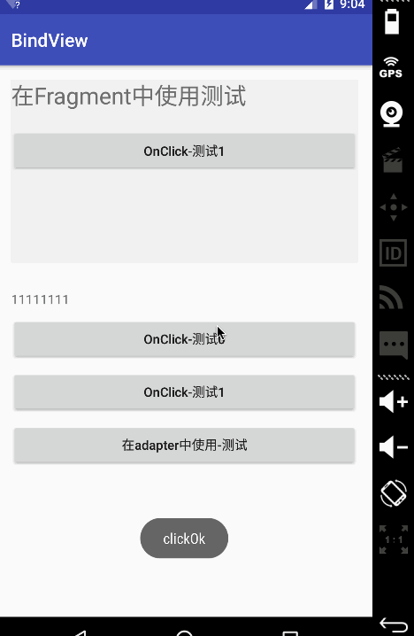

# BindView
 改项目主要是为了学习ButterKnife,而实现的view的注入,
 支持实现类似[ButterKnife](https://github.com/JakeWharton/butterknife) 的 `BindView`，`OnClick(多id）`，`BindLayout`
 `BindLayout`注解为：
 
 ```			
 @Retention(RetentionPolicy.CLASS)
 @Target(ElementType.TYPE)
 public @interface BindLayout {
     int value();
 }
 ```
 可以用来注解activity等布局文件,demo中只支持activity
 

#simple

``` 
package com.gxz.bindview;

import android.content.Intent;
import android.os.Bundle;
import android.support.v7.app.AppCompatActivity;
import android.widget.TextView;
import android.widget.Toast;

import com.example.BindLayout;
import com.example.BindView;
import com.example.OnClick;
import com.gxz.bindview_api.ViewInjector;

@BindLayout(R.layout.activity_main)
public class MainActivity extends AppCompatActivity {

    @BindView(R.id.tv)
    TextView mTextView;

    @Override
    protected void onCreate(Bundle savedInstanceState) {
        super.onCreate(savedInstanceState);
//        setContentView(R.layout.activity_main);
        ViewInjector.inject(this);
        mTextView.setText("11111111");
    }

    @OnClick({R.id.id_btn0, R.id.id_btn1})
    public void ok() {
        Toast.makeText(this, "ok", Toast.LENGTH_SHORT).show();
    }

    @OnClick(R.id.id_btn2)
    public void goList() {
        startActivity(new Intent(this, MainActivityList.class));
    }

}
 ```
 
 #效果图
 </p>